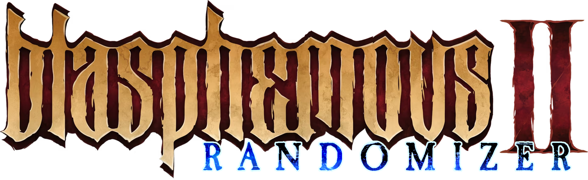

  <!-- Logo by JimmyDiamonds -->
  

---

  
  
  

---

## Contributors

A very special thank you to everyone who has helped with the randomizer

***- Programming -***  
[@BrandenEK](https://github.com/BrandenEK)

***- Gameplay and design -***  
[@BrandenEK](https://github.com/BrandenEK), [@LuceScarlet](https://github.com/LuceScarlet)

***- Logic development and testing -***  
[@Chemigoku](https://github.com/Chemigoku), [@Guuiil](https://github.com/Guuiil), [@PHAredes](https://github.com/PHAredes), [@thymemanagement](https://github.com/thymemanagement)

***- Images and UI -***  
[@JimmyDiamonds](https://github.com/JimmyDiamonds)
<!-- Expected: Raider -->

***- Translations -***  
[@LuceScarlet](https://github.com/LuceScarlet), [@Guuiil](https://github.com/Guuiil), [@PHAredes](https://github.com/PHAredes)
<!-- Expected: Elton -->

---

## Useful Info
- Currently works with both version 1.0.5 and 1.1.0
- In order to avoid softlocks, it is recommended to use the Save & Quit mod
- Pressing 'F8' will display a list of your current settings

---

## Gameplay Differences

- All regions of the game are unlocked from the beginning, though you will still need movement items to reach them
- The door to Crimson Rains will be unlocked after obtaining a certain number of keys, specified in your settings
- Weapon memories can be purchased from the beginning, the lance is no longer necessary
- The map screen will display the number of items collected
- All tutorials and most cutscenes have been automatically skipped

---

## Randomizer Settings

  <table>
    <tr>
      <td align="center"> Name </td>
      <td align="center"> Explanation </td>
      <td align="center"> Default </td>
    </tr>
    <tr>
      <td align="center"> Logic Difficulty </td>
      <td align="center"> Determines what skips and techniques may be required in the logic  
                          (See below for a more detailed breakdown) </td>
      <td align="center"> Normal </td>
    </tr>
    <tr>
      <td align="center"> Required Keys </td>
      <td align="center"> The number of keys required to open the door to Crimson Rains  
                          (All 5 will still be present in the item pool) </td>
      <td align="center"> Four </td>
    </tr>
    <tr>
      <td align="center"> Starting Weapon </td>
      <td align="center"> Which weapon will be available to pickup in the weapon selection room </td>
      <td align="center"> Random </td>
    </tr>
    <tr>
      <td align="center"> Shuffle Long Quests </td>
      <td align="center"> Whether or not long quests can contain progression items  
                          (They will still have random items) </td>
      <td align="center"> False </td>
    </tr>
    <tr>
      <td align="center"> Shuffle Shops </td>
      <td align="center"> Whether or not shops can contain progression items  
                          (They will still have random items) </td>
      <td align="center"> True </td>
    </tr>
  </table>

---

## Logic Difficulty

Currently there are no differences between difficulty settings

---

## Installation

Can be downloaded automatically through the <a href="https://github.com/BrandenEK/Blasphemous-Mod-Installer"> Mod Installer
